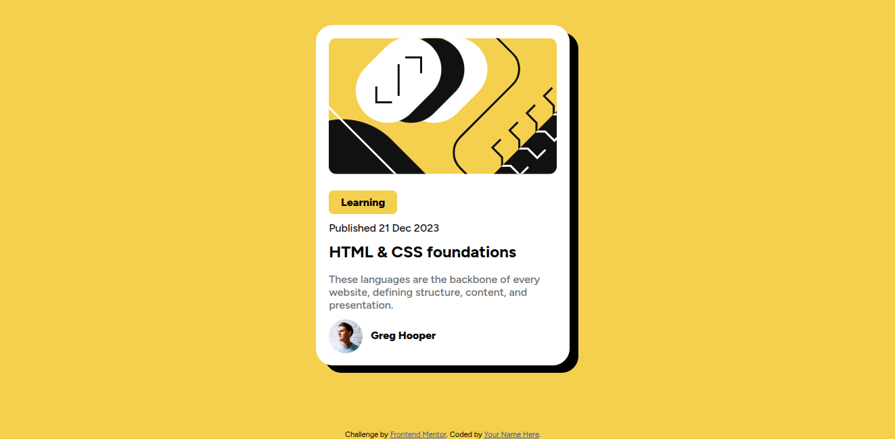

# Frontend Mentor - Blog preview card solution

This is a solution to the [Blog preview card challenge on Frontend Mentor](https://www.frontendmentor.io/challenges/blog-preview-card-ckPaj01IcS). Frontend Mentor challenges help you improve your coding skills by building realistic projects. 

## Table of contents

  - [The challenge](#the-challenge)
  - [Screenshot](#screenshot)
  - [Links](#links)
- [My process](#my-process)
  - [Built with](#built-with)
  - [What I learned](#what-i-learned)
- [Author](#author)

### The challenge

Users should be able to:

- See hover and focus states for all interactive elements on the page

### Screenshot

### Links

- Solution: [check out](https://github.com/William-nyarash/frontend-mentors.git)
- Live Site: [visit](https://your-live-site-url.com)

## My process
after creating the card I used the dev tools (*on linux it's F12*) to enable me visualize  how the box shadow will take effect on the card. It saved me a lot of time.

### Built with

- Semantic HTML5 markup
- CSS custom properties
- Flexbox
- Mobile-first workflow

### What I learned

To utilize the dev tools on the browser to tweak the design to  my preference

### Useful resources

- I utilized the developers tool on my browser to apply most of the design especially the box shadow
## Author
- Frontend Mentor - [@William-nyarash](https://www.frontendmentor.io/profile/william-nyarash)

