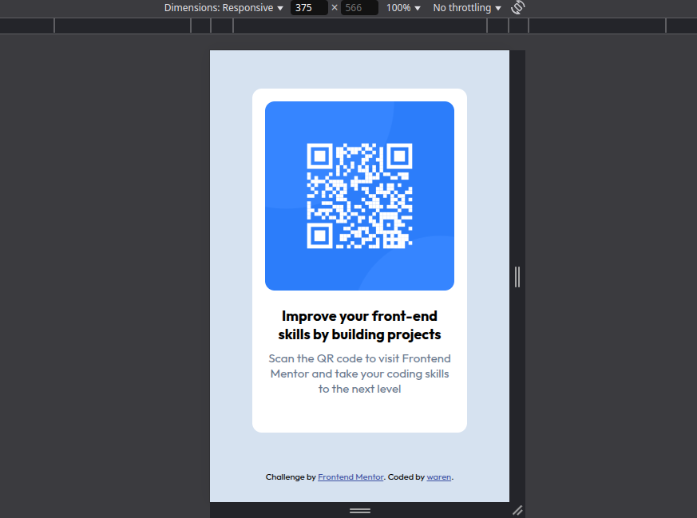

# Frontend Mentor - QR code component solution

This is a solution to the [QR code component challenge on Frontend Mentor](https://www.frontendmentor.io/challenges/qr-code-component-iux_sIO_H). Frontend Mentor challenges help you improve your coding skills by building realistic projects. 

## Table of contents

  - [Screenshot](#screenshot)
  - [Links](#links)
- [My process](#my-process)
  - [Built with](#built-with)
  - [What I learned](#what-i-learned)
- [Author](#author)

### Screenshot

### Links

- Solution URL: [here](https://github.com/William-nyarash/frontend-mentors.git)
under the `qr-code-component-main`  folder
- visit : [live site](https://your-live-site-url.com)

## My process
 I began by creating a container class for the card.
 I gave it  margin, padding and border radius. Then I specify the width, inserted the elements inside it ensuring that therre is space between them.

For the image I gave it a border radius to match the one for the container class, a max-width property of 100% to ensure it doesn't overflow

Added flex to  space the two elements inside the body element

### Built with

- Semantic HTML5 markup
- CSS custom properties
- Flexbox
- Mobile-first workflow

### What I learned

creating  layouts that are responsive
I also learnt how to utilize the min height in my design

## Author

- Frontend Mentor - [@William-nyarash](https://www.frontendmentor.io/profile/william-nyarash)
