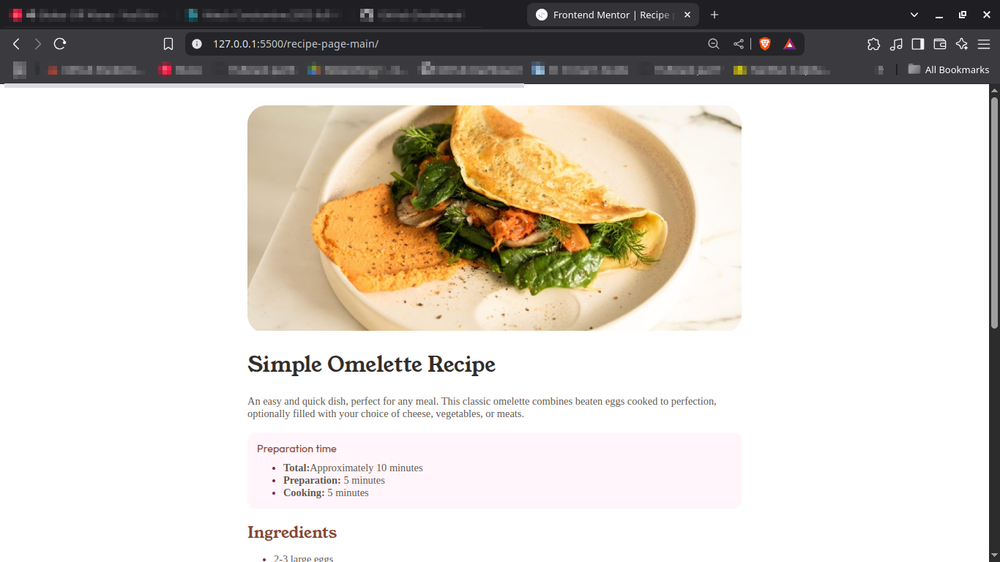

# Frontend Mentor - Recipe page solution

This is a solution to the [Recipe page challenge on Frontend Mentor](https://www.frontendmentor.io/challenges/recipe-page-KiTsR8QQKm). Frontend Mentor challenges help you improve your coding skills by building realistic projects. 

## Table of contents

  - [Screenshot](#screenshot)
  - [Links](#links)
- [My process](#my-process)
  - [Built with](#built-with)
  - [What I learned](#what-i-learned)
- [Author](#author)

### Screenshot

 
### Links


- Solution URL: [here](https://github.com/William-nyarash/frontend-mentors.git)
- Live Site: [live on](https://recipe-page-grjr.onrender.com)

## My process

created the site with mobile first aproach then used media querries to make it respond well on desktop sites

### Built with

- Semantic HTML5 markup
- CSS custom properties
- Flexbox
- CSS Grid
- Mobile-first workflow

### What I learned
using the below css rule to style the list
```css
ol[type="1"] li::marker,
ul li::marker {
    color: var(--color-rose-800);
}
```
## Author

- Frontend Mentor - [@William-nyarash](https://www.frontendmentor.io/profile/william-nyarash)
